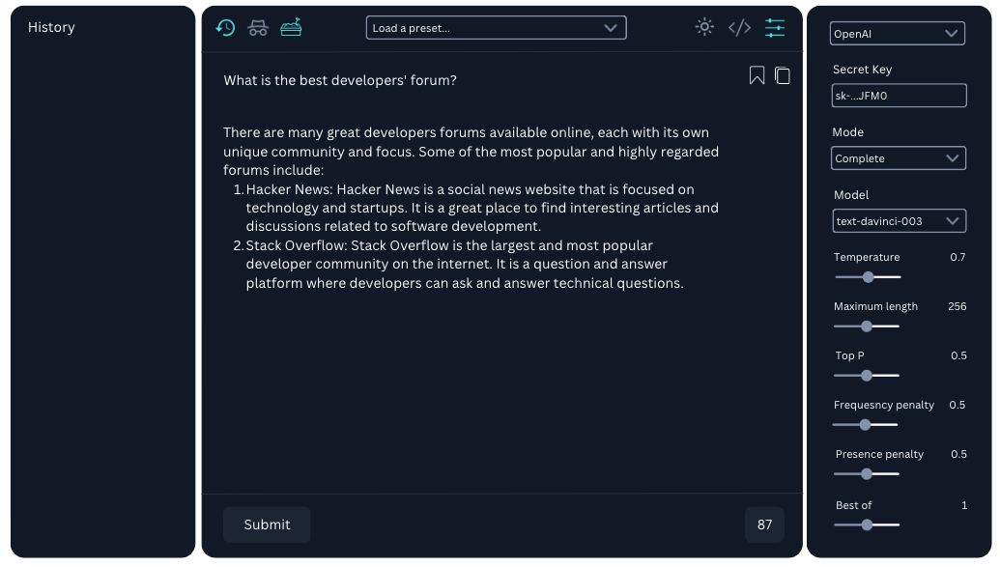

# Buddy

Buddy - a fun open source cmd+b interface to OpenAI’s API.

We got tired of searching both the chat and playground tabs of OpenAI every time we had a question, and quite annoyed when the free research preview did not work for a day. We searched for a simple interface to the chat API and found many paid extensions that sell buckets of queries for some $/mo, which there is no way we were gonna use, so we just built this.

The first version looks like this -

Note that besides calling OpenAI’s API, **everything runs locally on your browser.** 

# **Getting started**

1. Clone the repo install dependencies with `npm install` and `npm run build`)) || ([download](https://github.com/INT-Calutt/buddy/releases/tag/v0.1.1) build.zip and unzip the file).
2. Go to chrome://extensions, enable Developer mode and Load unpacked the folder (/dist).
3. Open a Chrome tab, press cmd+b, and enter your OpenAI API key on the right wing of buddy.

# **Roadamp**

- add conversations history
- different OpenAI models
- add playground mode
- control API parameters like temperature
- mark web text to load it as context
- choose the colors of the interface
- incognito mode to disable history
- shortcuts

Here’s what the playground mode will look like -

# Bugs

- buddy does not work in some domains.
- syntax highlighting and code view do not work in some domains.
- allows a question before the current response ends.
- presets functionality does not work.

# Things we’re exploring

- add chatGPT alternatives (LLaMa, alpaca, bing, bard).
- count tokens in prompt and completion.
- support chatGPT plugins (when/if available through the API).
- interface to fine-tune a model.

# This is a pre-release version

There’s obviously a lot to fix and polish, but we’ve used it a lot for the past two days even though many things don't work, and we really enjoyed it (we stopped using [https://chat.openai.com/chat](https://chat.openai.com/chat)). 

Hope you'll enjoy buddy as well, any feedback is more than welcome :)