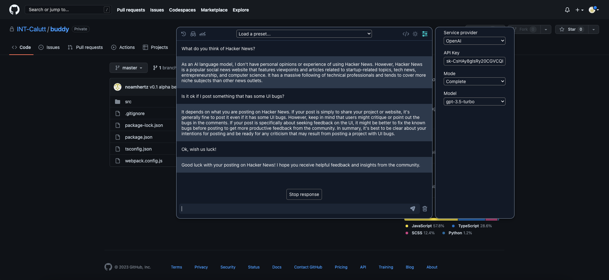

# Buddy

Buddy - open source cmdk interface to OpenAI’s API.

We just wanted a simple interface to OpenAI’s API and only found paid extensions that sell buckets of queries, so we just built this.

# **Getting started**

1. Clone the repository, install dependencies with `npm install`, and run `npm run build`. Alternatively, you can download the `build.zip` file from [here](https://github.com/INT-Calutt/buddy/releases/) and unzip it.
2. Go to `chrome://extensions`, enable Developer Mode and choose `Load unpacked` option. Then, select the unzipped folder.
3. Open a new tab, press `ctrl+m` (on both Mac and Windows), enter your API key, and you’re ready to go.

Note that besides calling OpenAI’s API, **everything runs locally on your browser**.

# **Roadmap**

- Add conversation history.
- Support multiple models.
- Add playground mode.
- Control API parameters such as temperature.
- Ability to mark web text and load it as context.
- Customize interface colors.
- Implement an incognito mode to disable history.
- Count tokens within the prompt and completion.
- Allow users to create custom presets.
- Add more shortcuts.

# This is a pre-release version

There is a lot to fix and polish, but we have been using Buddy a lot for the past two days and we are really enjoying it. (we stopped using [https://chat.openai.com/chat](https://chat.openai.com/chat)).

Pro tip - We also substituted our paid Grammarly account with three simple presets that you can load from Buddy's header. :)

Hope you'll enjoy it too!